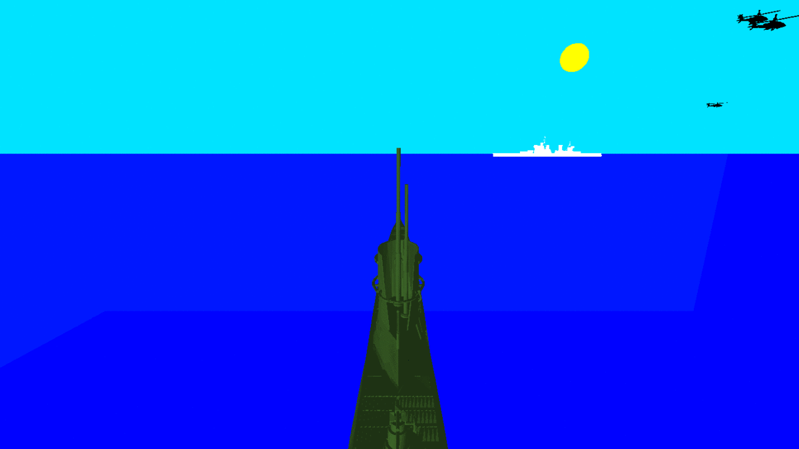

<h1 align="center">
	Submarine Simulator v1.0
</h1>

<h4 align="center">
	:hammer: Thiago Marinho Pereira
</h4>

<p align="center">


</p>

<p align="center">
	<a href="#rocket-technologies">Technologies</a>&nbsp;&nbsp;&nbsp;|&nbsp;&nbsp;&nbsp;
	<a href="#computer-key-controllers">Key controllers</a>&nbsp;&nbsp;&nbsp;|&nbsp;&nbsp;&nbsp;
	<a href="#wrench-installation">Installation</a>&nbsp;&nbsp;&nbsp;|&nbsp;&nbsp;&nbsp;
	<a href="#memo-license">License</a>
</p>

<br>

<p align="center">
	
</p>

## :rocket: Technologies

This project was built using following technologies:

- [C++](https://www.cplusplus.com/)
- [OpenGL](https://www.opengl.org/)
- [Blender](https://www.blender.org/)
- [OBJ models](https://free3d.com)

## :computer: Key controllers

* Arrow keys up and down to immerse ou emerge
* Arrow keys right and left to change submarine direction
* H and h enable or disable the help menu
* F and f or I and i change the camera position
* 1 enable or disable ambient light and key 2 enable or disable spotlight
* L or l enable or disable the light effects
* G or g toggle between Gouroud or Flat-Shading global shading models
* F11 toggle between windowed or fullscreen modes
* Esc to exit game

## :wrench: Installation

__You must install OpenGL library using the following commands on your Terminal:__

```bash
# Update packages (on Linux devices)
$ sudo apt update

# Install OpenGL library and its dependencies
$ sudo apt install libglu1-mesa-dev freeglut3-dev mesa-common-dev
```

__Execute the following commands to compile the code and run the game on your Terminal:__

```bash
# Compile the source code
$ make

# Run the game on your terminal
$ make start

# Run it if you want to clean binary files
$ make clean
```

## :memo: License

This project is under MIT License. Check out [LICENSE](LICENSE) file to more details.

---

<p align="center">
	Built with :hearts: by <a href="https://github.com/ThiagoPereiraUFV" target="_blank">Thiago Pereira</a>
</p>
