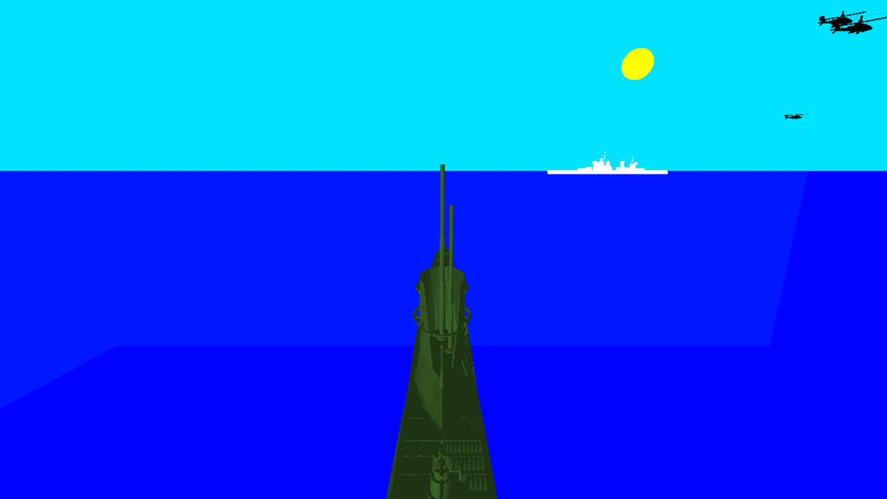

<h1 align="center">
	Submarine Simulator v1.0
</h1>

<h4 align="center">
	:hammer: Thiago Marinho Pereira
</h4>

<p align="center">


</p>

<p align="center">
	<a href="#rocket-technologies">Technologies</a>&nbsp;&nbsp;&nbsp;|&nbsp;&nbsp;&nbsp;
	<a href="#computer-key-controllers">Key controllers</a>&nbsp;&nbsp;&nbsp;|&nbsp;&nbsp;&nbsp;
	<a href="#wrench-installation">Installation</a>&nbsp;&nbsp;&nbsp;|&nbsp;&nbsp;&nbsp;
	<a href="#arrow_forward-run">Run</a>&nbsp;&nbsp;&nbsp;|&nbsp;&nbsp;&nbsp;
	<a href="#test_tube-test">Test</a>&nbsp;&nbsp;&nbsp;|&nbsp;&nbsp;&nbsp;
	<a href="#bar_chart-coverage">Coverage</a>&nbsp;&nbsp;&nbsp;|&nbsp;&nbsp;&nbsp;
	<a href="#memo-license">License</a>
</p>

<br>

<p align="center">
	
</p>

## :rocket: Technologies

This project was built using following technologies:

- [C++](https://www.cplusplus.com/)
- [OpenGL](https://www.opengl.org/)
- [Blender](https://www.blender.org/)
- [OBJ models](https://free3d.com)
- [doctest](https://github.com/doctest/doctest)
- [lcov](https://github.com/linux-test-project/lcov)
- [clang-format](https://clang.llvm.org/docs/ClangFormat.html)
- [clang-tidy](https://clang.llvm.org/extra/clang-tidy/)

## :computer: Key controllers

* Arrow keys up and down to immerse ou emerge
* Arrow keys right and left to change submarine direction
* H and h enable or disable the help menu
* F and f or I and i change the camera position
* 1 enable or disable ambient light and key 2 enable or disable spotlight
* L or l enable or disable the light effects
* G or g toggle between Gouroud or Flat-Shading global shading models (toggles the shading mode every press)
* F11 toggle between windowed or fullscreen modes
* Esc to exit game

## :wrench: Installation

__In order to install the required libraries and build the game, run the following command on your terminal:__

```bash
# Installs freeglut/GLU/lcov/xvfb and builds build/submarine
$ bash install.sh
```

Or, with the libraries already installed:

```bash
$ sudo apt install -y freeglut3-dev libglu1-mesa-dev mesa-common-dev lcov xvfb
$ make build
```

## :arrow_forward: Run

```bash
$ make run
```

## :broom: Lint and format

```bash
$ make lint
```

Checks formatting with `clang-format` (config in `.clang-format`) and runs the
`clang-tidy` checks in `.clang-tidy` as errors. To rewrite the sources in place:

```bash
$ make format
```

## :test_tube: Test

```bash
$ make test
```

Runs the doctest suite (`tests/*.cpp`) under `xvfb-run`, since the renderer
tests open a real (headless) GLUT window.

## :bar_chart: Coverage

```bash
$ make coverage
```

Builds an instrumented `run_tests`, runs it, and gates on 100% line coverage
via `lcov`/`genhtml` (report at `build/coverage/html/index.html`). `source/main.cpp`
is the only file not linked into `run_tests` and so the only code outside this
report: it is a 3-line composition root (`GlutRenderer` + `Simulation` + `Game`)
with no logic of its own to test, and `glutInit()` can only run once per
process, so it cannot be driven from inside the test binary a second time.

## :memo: License

This project is under MIT License. Check out [LICENSE](LICENSE) file to more details.

---

<p align="center">
	Built with :hearts: by <a href="https://github.com/ThiagoPereiraUFV" target="_blank">Thiago Pereira</a>
</p>
